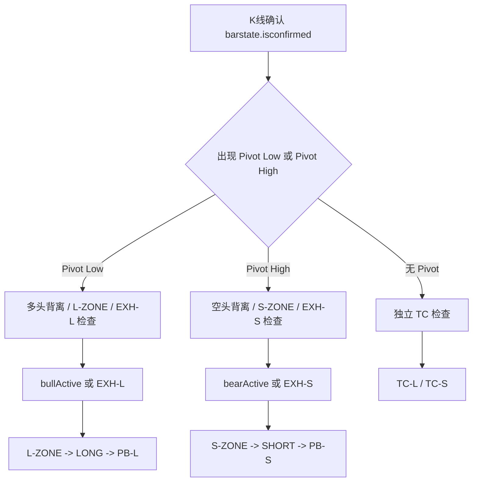
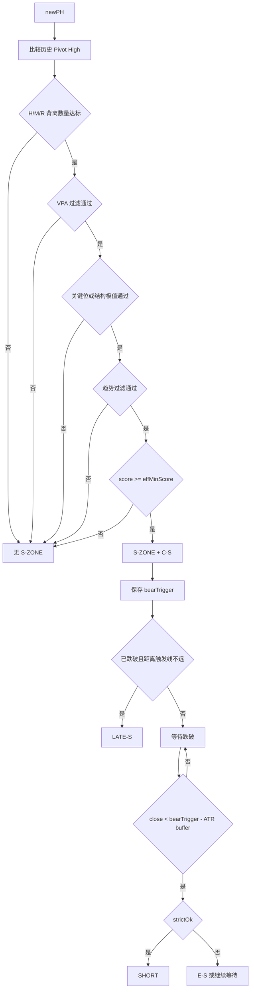
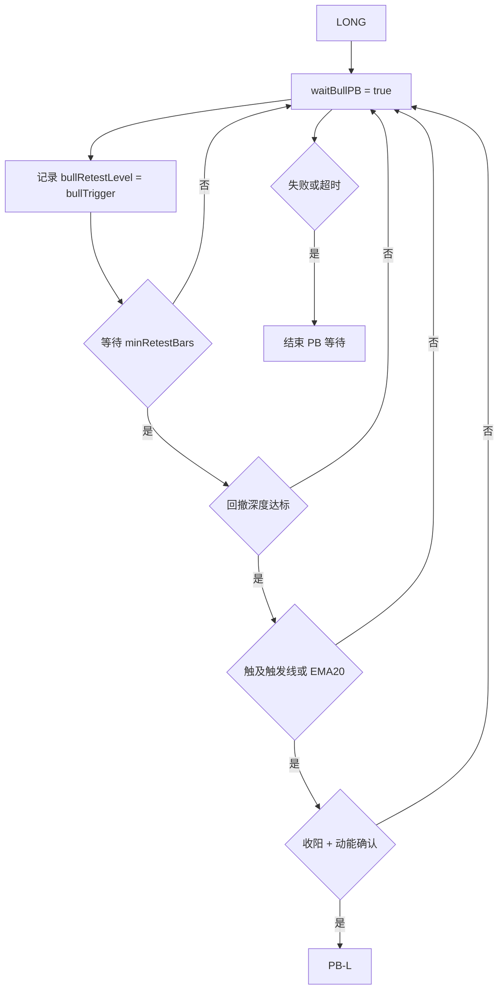
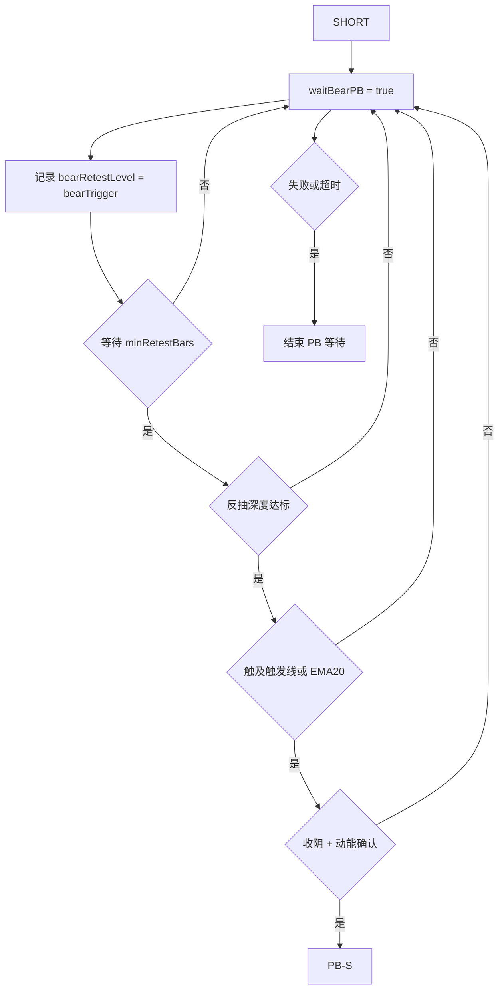
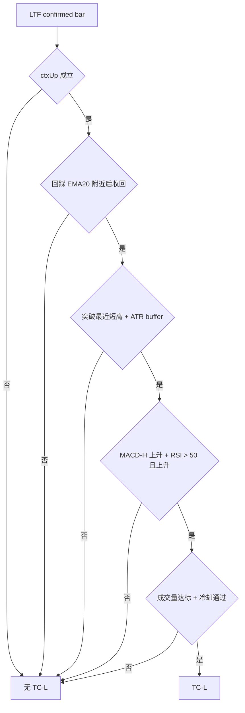
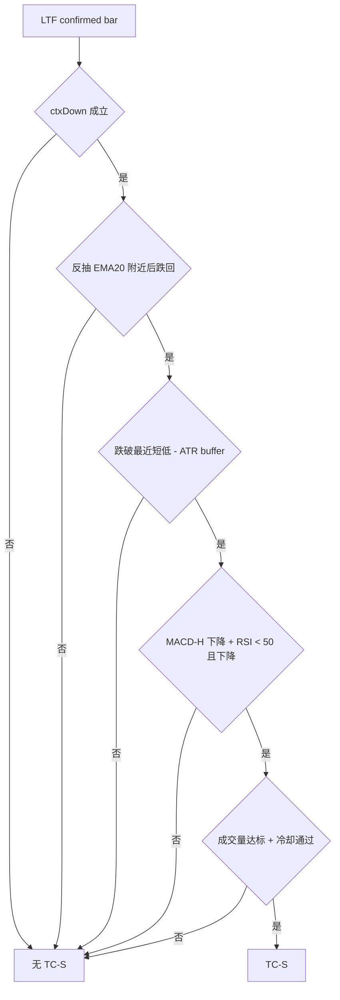
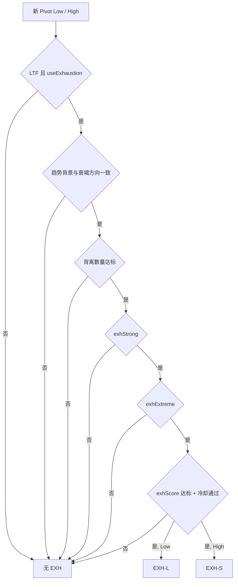

# DVCA v1.5.1 信号流程图

本文件用流程图描述 DVCA v1.5.1 的主要信号路径。图中所有节点都对应当前 Pine 代码中的实际逻辑。

## 总览流程

## L-ZONE 到 LONG

## S-ZONE 到 SHORT

## LONG 到 PB-L

## SHORT 到 PB-S

## TC-L 趋势延续

## TC-S 趋势延续

## EXH-L / EXH-S 衰竭提醒

