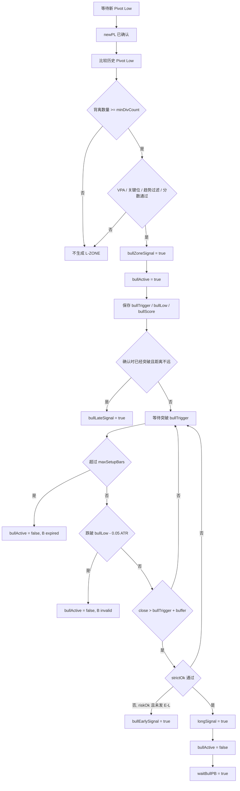
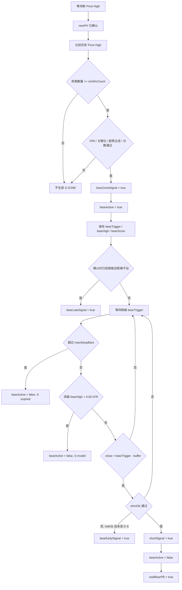
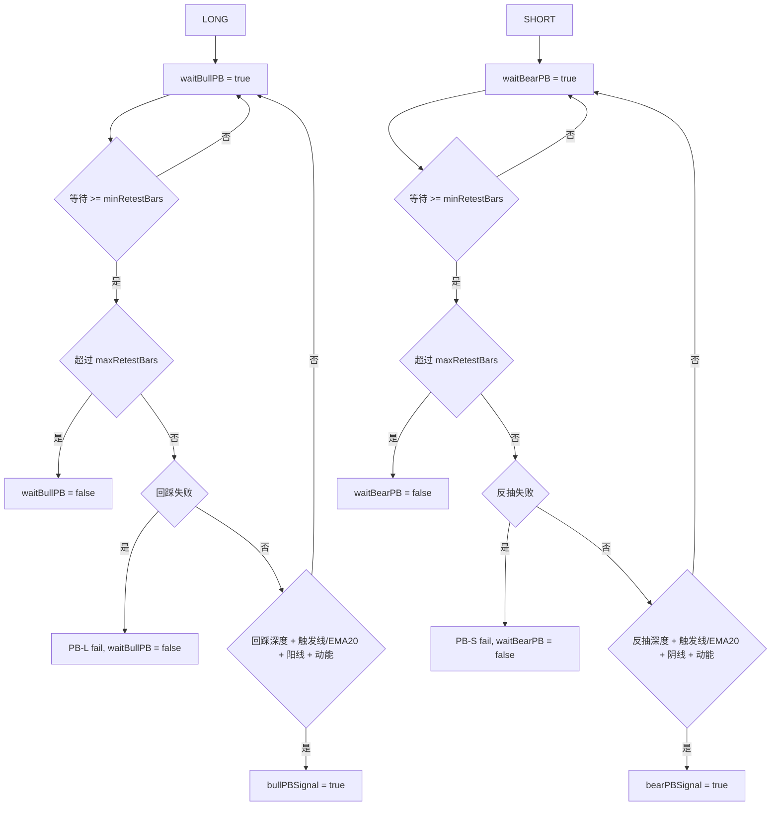
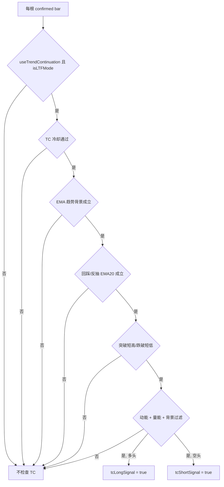
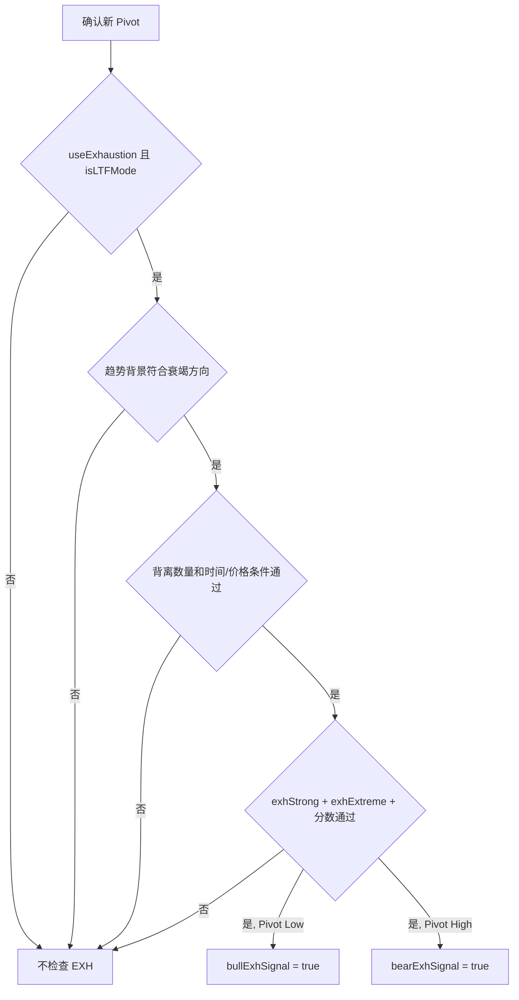

# DVCA v1.5.1 状态机

本文件描述 DVCA v1.5.1 中真实存在的状态变量和状态切换。所有内容基于 `indicator/dvca_v1_5_1.pine`。

## 核心状态变量

- `bullActive`：多头 Zone 已经成立，等待向上突破 `bullTrigger`。
- `bearActive`：空头 Zone 已经成立，等待向下跌破 `bearTrigger`。
- `waitBullPB`：LONG 已经出现，等待多头回踩确认 PB-L。
- `waitBearPB`：SHORT 已经出现，等待空头反抽确认 PB-S。
- `lastBullZoneIndex` / `lastBearZoneIndex`：记录同方向 Zone 冷却。
- `lastBullExhIndex` / `lastBearExhIndex`：记录同方向 EXH 冷却。
- `lastTCLongIndex` / `lastTCShortIndex`：记录同方向 TC 冷却。

## 多头反转状态机

### 多头状态说明

- `L-ZONE` 出现后，代码进入 `bullActive`。
- `bullActive` 期间只观察突破、过期或失效。
- `LONG` 出现后，多头反转状态结束，转入 `waitBullPB`。
- `E-L` 只表示突破发生但严格条件不足，不会结束 `bullActive`。
- `LATE-L` 是 Zone 被确认时价格已经突破触发线的补确认，不等同于 LONG。

## 空头反转状态机

### 空头状态说明

- `S-ZONE` 出现后，代码进入 `bearActive`。
- `bearActive` 期间只观察跌破、过期或失效。
- `SHORT` 出现后，空头反转状态结束，转入 `waitBearPB`。
- `E-S` 只表示跌破发生但严格条件不足，不会结束 `bearActive`。
- `LATE-S` 是 Zone 被确认时价格已经跌破触发线的补确认，不等同于 SHORT。

## PB 状态机

### PB 状态说明

- PB-L 只能来自 LONG 后的 `waitBullPB`。
- PB-S 只能来自 SHORT 后的 `waitBearPB`。
- 代码不允许没有 LONG/SHORT 就直接出现 PB-L/PB-S。
- PB 等待会因为失败条件或超过 `maxRetestBars` 结束。

## TC 独立状态机

### TC 状态说明

- TC-L / TC-S 不依赖 L-ZONE / S-ZONE。
- TC-L 要求 `not longSignal`，TC-S 要求 `not shortSignal`，避免同一根和正式突破信号重叠。
- TC 是趋势延续路径，不是背离反转路径。

## EXH 独立提醒

### EXH 状态说明

- EXH-L / EXH-S 是提醒，不会设置 `bullActive` 或 `bearActive`。
- EXH 不会直接生成 LONG / SHORT。
- EXH 后是否转化为 Zone 或 Entry，需要在案例库中通过 `signal_chain` 记录。

